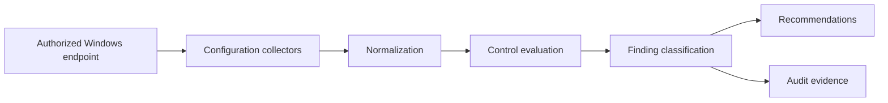

# Architecture

## 1. Two-dimensional line architecture

```text
                              PROCESS DIMENSION
               COLLECT -------- EVALUATE -------- REPORT
                  |                 |                |
Remote Access --> Services -------- Policy -------- Findings
                  |                 |                |
Network -------> Firewall -------- Exposure ------ Recommendations
                  |                 |                |
Identity ------> Privilege ------- Control -------- Exceptions
                  |                 |                |
Endpoint ------> Registry -------- Baseline ------ Evidence

                  +------------- GOVERNANCE -------------+
                  | Scope | Authority | Risk | Audit Trail |
                  +----------------------------------------+
```

## 2. Metafield model

| Metafield | Description |
|---|---|
| Purpose | Defensive Windows configuration assessment |
| Actor | Authorized administrator, auditor, or security learner |
| Input | Services, registry, firewall, network, and security settings |
| Trigger | Manual assessment or controlled verification |
| Process | Collect, normalize, compare, classify, recommend |
| Decision | Pass, fail, warning, unknown, or not applicable |
| Output | Human-readable or structured findings |
| Evidence | Observed state, expected state, rationale, timestamp |
| Control | Least privilege, report-only default, approved scope |
| Risk | False positives, disruption if assessment becomes enforcement |
| Recovery | No change in assessment mode; rollback required for remediation |
| Boundary | Local authorized Windows endpoint |

## 3. Component flow



## 4. Design rules

- Assessment and remediation should remain separate.
- Report-only behavior should be the default.
- Missing data should be reported as unknown, not automatically passed.
- Environment-specific policy should be externalized into configuration.
- Operational reports must never be committed to the public repository.
